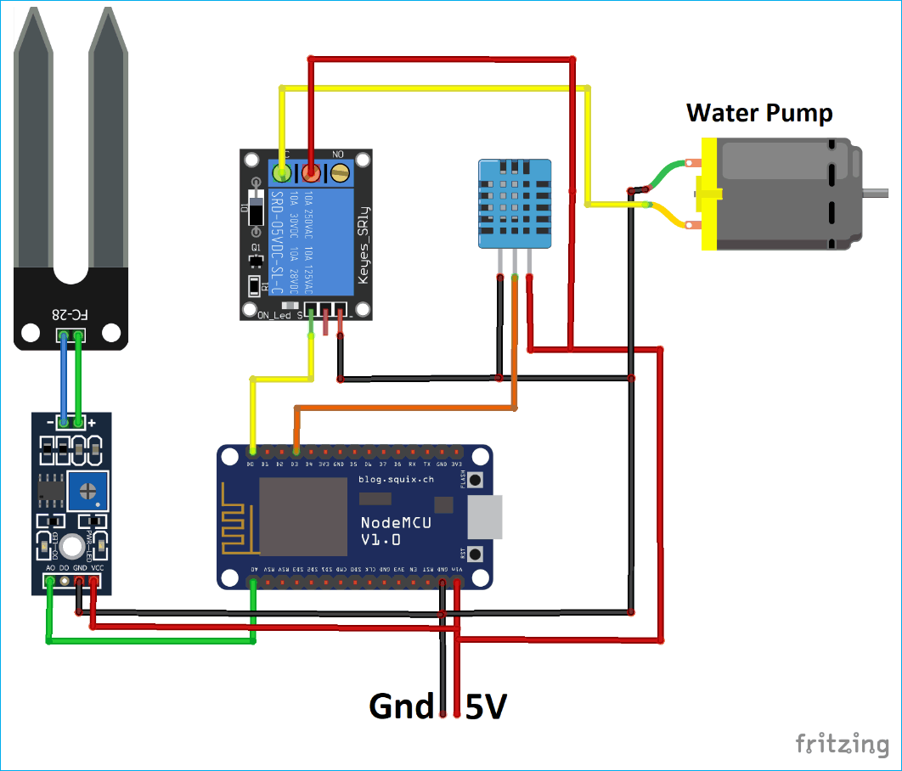

# Smart-irrigation-System-
# 🌿 Automatic Smart Irrigation System

An open‑source automatic irrigation system that measures soil moisture and water depth, then triggers watering only when needed...

...
## 📸 Parts Used

  

## 🔍 Objective
- Automate irrigation to save time, water, and energy  
- Deploy a scalable prototype with minimal human intervention  
- Modular design for easy future enhancements  
- Enable remote monitoring and data logging  

## 🛠️ Hardware Components
- Arduino Uno  
- NodeMCU (ESP8266)  
- DS1307 RTC module  
- Soil moisture sensor  
- Water depth sensor  
- 5 V single-channel relay  
- 16×2 LCD display  
## 📸 Circuit Diagram

  

## 💾 Software Tools
- Arduino IDE  
- ThingSpeak account (READ + WRITE API keys)

---

## 📌 Wiring Diagram

### RTC → Arduino
- VCC → 5 V, GND → GND, SDA → SDA, SCL → SCL  

### LCD → Arduino
- 1 (GND) → GND  
- 2 (5 V) → 5 V  
